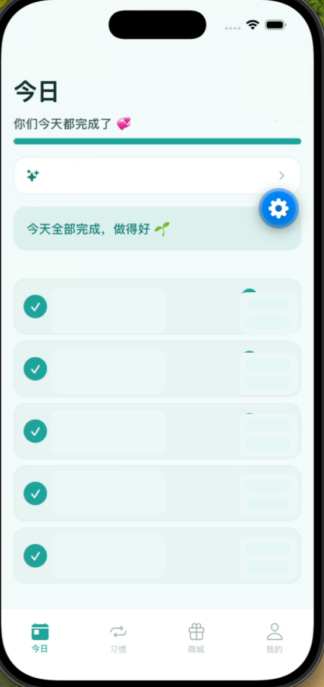

# 每日打卡

一款面向双人共享的习惯打卡工具。它把习惯计划、每日打卡、积分奖励、情侣空间同步和 AI 计划生成放在同一个轻量 App 里，适合两个人一起养成习惯、互相鼓励，也适合作为 Expo + Express 全栈移动项目参考。

## 项目亮点

- **AI 制定习惯计划**：输入目标、基础、周期、频率和提醒偏好，由后端调用 OpenAI 生成可执行的分阶段计划。
- **双人共享空间**：账号注册后进入同一个 space，习惯、打卡、积分、奖励和设置按空间隔离并云端同步。
- **积分与奖励商城**：完成打卡获得 XP，支持创建奖励、兑换记录、兑现管理和 owner/member 权限控制。
- **实时同步体验**：后端通过 WebSocket 推送数据变更，客户端可在远端变化后刷新页面状态。
- **R2 图片直传**：头像和奖励图片走 Cloudflare R2 presigned upload，服务端只保存对象 key，图片读取走公开域名。
- **Android 自动更新**：`v*` tag 发版后自动构建 APK，上传 GitHub Release 并同步到 R2；App 内可检查更新并打开下载链接。
- **本地优先的移动体验**：客户端使用 SQLite 管理本地数据结构，前端配套提醒、主题、日历、庆祝动画和数据导出。

## 项目截图

<p align="center">
  
</p>

## 技术栈

### 移动端

- Expo 57 / React Native 0.86 / React 19
- Expo Router 文件路由
- TypeScript
- Expo SQLite
- Expo Notifications
- Expo Image / Image Picker / File System
- React Native Reanimated
- Vitest 单元测试

### 后端

- Node.js / Express 5
- TypeScript
- PostgreSQL
- WebSocket (`ws`)
- JWT 登录态
- bcryptjs 密码哈希
- Zod 请求与 manifest 校验
- OpenAI SDK
- Cloudflare R2（S3 兼容 SDK + presigned upload）
- Docker / Docker Compose

### CI/CD 与发布

- GitHub Actions：客户端/服务端 CI、服务端部署、Android APK 构建
- EAS Build：Android 内部分发 APK / AAB
- GHCR / Docker Compose：服务端镜像与部署
- Cloudflare R2：图片存储、APK 镜像与 `latest.json` 更新清单

## 目录结构

```text
.
├── app/                    # Expo Router 页面
├── src/                    # 移动端业务模块、UI、同步、奖励、更新检查
├── server/                 # Express + PostgreSQL 后端
├── assets/                 # App 图标、启动图等资源
├── docs/                   # 部署文档、需求/方案/验证记录
├── .github/workflows/      # CI、后端部署、移动端构建发布
├── app.config.js           # 按 APP_ENV 注入后端与 R2 公网地址
├── app.json                # Expo App 配置
└── eas.json                # EAS build profile
```

## 本地开发

### 1. 安装依赖

```bash
npm install
cd server && npm install
```

### 2. 准备后端环境

在 `server/.env` 中配置：

```bash
PORT=8787
DATABASE_URL=postgres://habit:<password>@localhost:5432/habit
JWT_SECRET=<强随机字符串>
OPENAI_API_KEY=<你的 OpenAI 或兼容服务 Key>
OPENAI_MODEL=gpt-5.5
API_KEY=<可选，生产环境建议必填>
RATE_LIMIT_MAX=60

R2_ACCOUNT_ID=<Cloudflare Account ID>
R2_ACCESS_KEY_ID=<R2 Access Key ID>
R2_SECRET_ACCESS_KEY=<R2 Secret Access Key>
R2_BUCKET=<R2 bucket 名>
APP_UPDATE_MANIFEST_URL=https://你的R2公开域名/releases/android/latest.json
```

启动后端：

```bash
cd server
npm run dev
```

### 3. 启动 App

```bash
npm run start
```

常用入口：

```bash
npm run android
npm run ios
npm run web
```

## 质量检查

```bash
# 移动端
npm test
npx tsc --noEmit
npm run lint

# 后端
cd server
npm test
npm run build
```

## 部署

项目有两个发布单元：后端服务和移动 App。详细步骤见 [docs/deployment.md](docs/deployment.md)。

### 后端部署

服务器需要 Docker 和 Docker Compose。远端 `/root/habit-server/.env` 配好数据库、JWT、OpenAI、R2、更新 manifest 等环境变量后，可使用项目内脚本部署：

```bash
cd server
./deploy.sh
```

脚本会：

- 本地执行后端 TypeScript build
- 打包 `server/` 必要源码到服务器
- 远端重建并重启 `habit-app`
- 检查 `/habit/health`

### Android 发版与自动更新

首次配置 GitHub Secrets：

```text
EXPO_TOKEN
R2_ACCOUNT_ID
R2_ACCESS_KEY_ID
R2_SECRET_ACCESS_KEY
R2_BUCKET
```

GitHub Variables：

```text
R2_PUBLIC_BASE=https://你的R2公开域名
R2_RELEASE_PREFIX=releases/android   # 可选
R2_RELEASE_KEEP=5                    # 可选
```

发版流程：

```bash
# 1. 修改 app.json 里的 expo.version，例如 1.0.1
git add app.json
git commit -m "chore: 升级版本到 1.0.1"
git push

# 2. 打 tag
git tag v1.0.1
git push origin v1.0.1
```

`v*` tag 会触发 `.github/workflows/eas-build.yml`：

- 构建 Android `production-apk`
- 上传 APK 到 GitHub Release
- 上传 APK 到 R2：`releases/android/v1.0.1/app.apk`
- 更新 R2 manifest：`releases/android/latest.json`
- 自动清理超出保留数量的旧版本目录

App 内“我的 → 应用更新 → 检查”会请求后端代理接口：

```text
GET /api/app-update/latest?platform=android
```

后端读取 `APP_UPDATE_MANIFEST_URL` 指向的 R2 `latest.json`，客户端只按 `version` 判断是否有新安装包。

## 环境地址

`app.config.js` 会根据 `APP_ENV` 注入地址：

- development：`http://127.0.0.1:8787`、`https://lzch.eu.org`
- production：

如需覆盖：

```bash
APP_ENV=production API_BASE_URL=https://habit.example.com R2_PUBLIC_BASE=https://cdn.example.com npm run start
```

## 相关文档

- [部署文档](docs/deployment.md)
- [MVP 验证清单](docs/verification/v1-mvp-checklist.md)
- [Android 自动更新设计](docs/superpowers/specs/2026-07-09-android-app-update-design.md)
