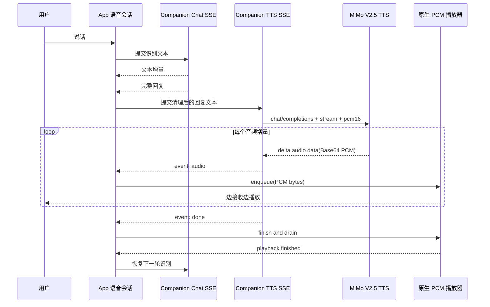

# 卡卡 MiMo-V2.5-TTS 真流式语音设计

## 状态

- 日期：2026-07-21
- 状态：草案，待用户确认
- 适用范围：卡卡主动语音对话的 MiMo TTS 音频流与移动端实时播放
- 设计来源：[MiMo 语音合成 v2.5 官方文档](https://mimo.mi.com/docs/zh-CN/quick-start/usage-guide/audio/speech-synthesis-v2.5)

## 背景

当前卡卡的语音输入使用设备原生语音识别，语音输出通过 `expo-speech` 调用系统 TTS。系统 TTS 不需要网络，但音色受设备影响，不能形成稳定的卡卡角色声音。

MiMo-V2.5-TTS 提供 OpenAI 兼容的语音接口：基础模型支持 `stream: true`，返回 24kHz、单声道、PCM16LE 音频增量。当前项目已有鉴权陪伴接口和文本 SSE，但没有 PCM 音频队列播放器。

## 已确认的目标

1. 卡卡语音对话使用 MiMo `mimo-v2.5-tts` 的预置中文音色。
2. 音频以 PCM 流边接收边播放，不等待完整 WAV 文件生成。
3. MiMo API Key 只保存在服务端，不进入移动端包体、请求体或日志。
4. 网络、鉴权、额度或播放器失败时，核心语音对话仍可回退到系统 TTS。
5. 保留现有语音识别、唤醒词、卡卡动画、共同对话记录和文字聊天行为。

## 非目标

- 首期不做 `mimo-v2.5-tts-voiceclone` 声音克隆；官方文档说明该模型暂未提供真正的低延迟流式能力。
- 首期不做后台播放、锁屏播放、通话模式和多路声音混音。
- 首期不做“文字模型生成一个字就立即合成”的端到端 LLM/TTS 重叠流水线；首期在完整文字回复产生后启动 MiMo 音频流。后续如需更低首字延迟，再单独设计分句队列。
- 不把任意用户可控的音色描述、音频样本或自由音频标签暴露为客户端 API。
- 不保存或上传生成后的音频文件；语音只存在于当前会话的播放队列。

## 决策与约束

### 推荐方案

采用“服务端代理 MiMo SSE + 客户端原生 PCM 队列”的架构。

- 服务端负责鉴权、限流、文本清理、固定卡卡风格、MiMo 请求和错误归一化。
- 客户端只访问自己的 `/api/companion/tts`，不直接访问 `api.xiaomimimo.com`。
- 客户端收到音频增量后交给原生 PCM 播放器；`expo-speech` 保留为降级路径。

### MiMo 调用契约

服务端调用：

```text
POST https://api.xiaomimimo.com/v1/chat/completions
api-key: $MIMO_API_KEY
Content-Type: application/json
```

请求主体：

```json
{
  "model": "mimo-v2.5-tts",
  "messages": [
    {
      "role": "user",
      "content": "温柔、轻快、亲近，像一只陪伴用户的小海豹。"
    },
    {
      "role": "assistant",
      "content": "今天也陪你完成一个小目标。"
    }
  ],
  "audio": {
    "format": "pcm16",
    "voice": "冰糖"
  },
  "stream": true
}
```

服务端只允许预置音色白名单：`冰糖`、`茉莉`、`苏打`、`白桦`。默认使用 `冰糖`，避免 `mimo_default` 因部署集群变化而改变卡卡音色。MiMo 流式响应中的 `choices[0].delta.audio.data` 是 Base64 编码的 PCM16LE 数据，采样率 24kHz、单声道。

### 应用内 TTS 契约

客户端请求：

```http
POST /api/companion/tts
Authorization: Bearer <session-token>
Content-Type: application/json
```

```json
{
  "text": "今天也陪你完成一个小目标。"
}
```

客户端不能提交 MiMo model、API Key、任意上游 URL 或 voice clone 音频。服务端固定模型、音色和风格，客户端只提交待播报文本。

服务端向客户端输出稳定的应用级 SSE，不直接暴露 MiMo 的供应商字段：

```text
event: audio
data: {"data":"<base64-pcm16>","sampleRate":24000,"channels":1,"encoding":"pcm_s16le"}

event: done
data: {}

```

错误使用统一事件：

```text
event: error
data: {"code":"tts_unavailable","message":"语音服务暂时不可用"}
```

响应必须设置 `Content-Type: text/event-stream`、`Cache-Control: no-cache, no-transform`，并在客户端断开连接时中止上游 MiMo 请求。

## 总体流程



## 现状与变化

### 语音对话编排

**现状**

- [src/pet/usePetVoiceConversation.ts](/Users/cheng/work/Project/tool/打卡工具/src/pet/usePetVoiceConversation.ts) 负责原生识别、调用 `sendMessage`、调用 `Speech.speak` 和恢复监听。
- [src/pet/useCompanionEngine.ts](/Users/cheng/work/Project/tool/打卡工具/src/pet/useCompanionEngine.ts) 的 `sendChat` 已接收文本 SSE 增量，但对调用方只返回完整回复字符串。
- [src/pet/companionClient.ts](/Users/cheng/work/Project/tool/打卡工具/src/pet/companionClient.ts) 已有可处理分片 SSE 的文本流实现。

**变化**

- 把“文字回复完成后播报”改为“文字回复完成后启动 TTS 音频流，并在首个可播放 PCM 块到达后进入 speaking 状态”。
- 将 TTS 请求、音频流解析、PCM 播放和取消生命周期从语音识别 hook 中分离，避免继续增大已经接近文件上限的 `usePetVoiceConversation.ts`。
- `interrupt` 和 `stop` 必须同时取消 TTS SSE、清空 PCM 队列并停止原生播放器。

### 音频播放名词层

**现状**

- `package.json` 只有 `expo-speech`，没有可消费裸 PCM 的音频运行时。
- 现有 `expo-speech` 只接受文本，不接受 MiMo 的 Base64 PCM 增量。

**变化**

新增一个平台无关的 `PcmPlayer` 契约，底层由 iOS `AVAudioEngine` / Android `AudioTrack` 或等价的原生 PCM 播放实现提供：

```ts
type PcmFormat = {
  sampleRate: 24000;
  channels: 1;
  encoding: "pcm_s16le";
};

type PcmPlayer = {
  start(format: PcmFormat): Promise<void>;
  enqueue(chunk: Uint8Array): void;
  finish(): Promise<void>;
  stop(): Promise<void>;
};
```

播放队列必须保持增量顺序、支持背压、可清空、可检测 underrun。首个音频块到达后先积累一个很短的启动缓冲，再开始播放，减少网络抖动造成的第一处断音。缓冲长度是实现参数，不作为服务端协议的一部分。

### 服务端模型层

**现状**

- [server/src/companion/companionRoutes.ts](/Users/cheng/work/Project/tool/打卡工具/server/src/companion/companionRoutes.ts) 已挂载鉴权陪伴 SSE。
- [server/src/companion/companionModel.ts](/Users/cheng/work/Project/tool/打卡工具/server/src/companion/companionModel.ts) 使用 OpenAI SDK 的 `Authorization` 方式处理文字模型流。
- [server/src/companion/companionModelResolver.ts](/Users/cheng/work/Project/tool/打卡工具/server/src/companion/companionModelResolver.ts) 解析空间文字模型配置。

**变化**

- 增加独立的 MiMo TTS provider，不复用文字 `CompanionModel` 的返回类型，也不假设上游使用标准 `Authorization` 头。
- 新增 TTS 路由和服务级限流；使用服务端 `MIMO_API_KEY`，默认 `MIMO_TTS_BASE_URL=https://api.xiaomimimo.com/v1`、`MIMO_TTS_MODEL=mimo-v2.5-tts`、`MIMO_TTS_VOICE=冰糖`。
- 文本先复用现有语音清理规则，移除代码块、链接、Markdown 标记并限制长度；不把模型输出中的任意控制标签直接透传给 MiMo。
- Provider 错误只记录脱敏的阶段、HTTP 状态和错误码，不记录 API Key、Authorization、完整用户文本或 Base64 音频。

## 挂载点与可卸载性

删除以下挂载点后，MiMo 流式语音功能应完全消失，系统 TTS 和语音识别仍可用：

1. 服务端 `/api/companion/tts` 路由、MiMo provider 与 `MIMO_*` 环境变量。
2. 客户端 TTS SSE 客户端与 `PcmPlayer` 原生模块。
3. 语音会话 hook 中的 TTS 分支、取消处理和系统 TTS fallback 分支保留为默认实现。
4. MiMo TTS 相关测试、开发构建配置和音频运行时依赖。

不新增数据库表、迁移、同步资源或共享对话字段；生成音频不持久化。

## 结构健康度与微重构

### 文件级

- `usePetVoiceConversation.ts` 当前已包含识别、TTS、取消、重启和生命周期处理，继续塞入 SSE 与 PCM 细节会扩大职责混合和测试范围。
- 方案要求先把 TTS 请求和播放器编排拆出独立模块，`usePetVoiceConversation` 只保留会话状态机和适配调用；这是职责拆分，不改变现有识别行为。

### 目录级

- `src/pet/` 已按 companion、voice、UI 和状态文件平铺，但语音相关文件已有稳定前缀，新增 TTS 模块仍放在 `src/pet/` 与现有命名一致，不做目录重组。
- `server/src/companion/` 已是陪伴 API 的稳定边界，TTS provider 和路由放在此处，不新建平行的 `audio/` 服务目录。

### 超出范围的观察

当前 `useCompanionEngine.sendChat` 只在完整文本返回后才把结果交给语音 hook。要实现 LLM 文本生成与 TTS 同时进行，需要分句队列、句间取消和多次 TTS 请求，属于独立的端到端低延迟 feature，不作为本设计的前置依赖。

## 错误、取消与降级语义

1. TTS 请求在首个音频块前失败：停止 TTS，使用完整文字调用系统 TTS；用户不应看到原始 HTTP 或 provider 错误。
2. TTS 已经开始播放后失败：停止并清空 PCM 队列，不重复播放整段文字；显示通用语音中断状态，随后恢复识别。
3. 用户打断：中止 TTS 请求，丢弃待播缓冲，停止播放器，然后回到 listening。
4. 用户结束会话、页面卸载、切换账号或 App 进入后台：所有 TTS 请求和播放器必须取消，迟到的音频事件不得重新改变状态。
5. 播放器 underrun：允许短暂等待后继续接收；连续 underrun 或原生模块异常按播放失败处理。
6. MiMo 限流、免费额度耗尽或服务不可用：按首块前/后两种语义处理，不改变文字聊天和语音识别能力。

## 验收契约

### 正常路径

- 用户完成一次语音输入后，卡卡使用预置中文音色播报，成功时不调用系统 TTS。
- TTS SSE 返回第一个 PCM 音频事件后，界面进入“卡卡在回答”，播放器开始出声；不需要等待完整 WAV 文件。
- 多个音频事件按服务端顺序连续播放，收到 `done` 后等待播放队列排空，再恢复下一轮识别。
- 播放中按打断按钮，声音立即停止，未播放的音频被丢弃，随后可以继续说话。

### 边界路径

- 空白、只含 Markdown、超出长度上限或无可播报内容时，不发 TTS 请求，沿用现有空回复处理。
- SSE 在任意字节边界切开、单个事件包含多行或 Base64 分片时，解析结果仍保持正确顺序。
- 语音会话重复启动、账号切换或页面卸载后，迟到的 `audio`、`done`、`error` 事件不污染新会话。
- `mimo-v2.5-tts` 返回正常 PCM；不接受错误采样率、声道数或编码的音频事件。

### 错误路径

- 未登录或服务端 TTS 返回 401/403/429/5xx 时，客户端不显示原始错误；首块前按规则回退系统 TTS。
- MiMo API Key 缺失时，服务端启动不崩溃，TTS 路由返回稳定错误，文字聊天仍可用。
- 原生 PCM 播放模块缺失或初始化失败时，回退系统 TTS，不要求用户重新授予麦克风权限。
- 任何失败都不得把 API Key、完整请求头或 Base64 音频写入日志。

### 明确不做的反向核对

- 不从移动端直接请求 MiMo。
- 不把 MiMo TTS 的 API Key 放到 `EXPO_PUBLIC_*`、App 配置或用户可读设置中。
- 不把 voice clone 音频样本上传到本项目服务端。
- 不把生成音频写入共同对话、数据库、同步事件或长期缓存。
- 不把首期“音频流式播放”宣称为“LLM 与 TTS 完全并行生成”。

## 推进策略

1. **契约骨架**：先确定服务端 TTS SSE 事件格式、MiMo provider 配置和 PCM 播放器契约；退出信号是客户端与服务端类型及错误语义一致。
2. **服务端 provider**：实现 MiMo 非流式/流式响应解析、鉴权、限流、文本清理、取消和脱敏日志；退出信号是 provider 测试能覆盖碎片化 SSE、Base64 PCM、上游错误和 `[DONE]`。
3. **原生播放层**：实现 24kHz 单声道 PCM 队列的 start/enqueue/finish/stop，并在 iOS、Android development build 中验证首块播放、连续队列、打断和 underrun；退出信号是设备端不依赖系统 TTS 即可播放测试音频。
4. **客户端语音编排**：把 TTS SSE 客户端接入语音 hook，接通 speaking 状态、取消、恢复监听和系统 TTS fallback；退出信号是现有语音识别测试不回归，且流式播放状态机测试通过。
5. **端到端验收**：在真实 MiMo 凭证和 iOS/Android development build 上验证网络正常、限流、断网、切后台、切账号和重复操作；退出信号是本节验收契约全部有可观察证据。

## 待用户确认的决策

本稿推荐以下默认值，但在进入实现前需要确认：

1. 首期使用中文女声 `冰糖`，不做音色克隆。
2. MiMo Key 使用服务端 `MIMO_API_KEY`，不复用用户在 App 内填写的文字模型 Key。
3. 首期的“真流式”定义为 TTS 音频边生成边播放；LLM 完整回复后再启动 TTS，不做端到端分句并行。
4. 原生 PCM 播放能力需要 development build；Expo Go 不作为验收环境。
